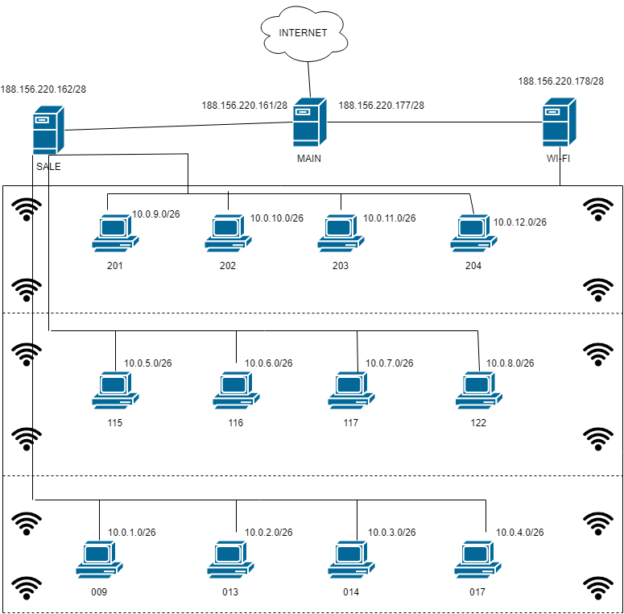

# Projekt sieci lokalnej dla jednostki dydaktycznej uniwersytetu  

* sale - ``188.156.220.160/28``
  * podsieć - ``10.0.0.0/16``
* WI-FI - ``188.156.220.176/28``
  * podsieć - ``11.0.0.0/22``

## Poziom 0
Mamy tutaj 3 sale oraz 1 sala planowana (140 stanowiska):  
* 009 ``10.0.1.0/26``
* 013 ``10.0.2.0/26``
* 014 ``10.0.3.0/26``
* 017 ``10.0.4.0/26``
## Poziom 1
Mamy tutaj 4 sale (140 stanowiska):
* 115 ``10.0.5.0/26``
* 116 ``10.0.6.0/26``
* 117 ``10.0.7.0/26``
* 122 ``10.0.8.0/26``
## Poziom 2
Mamy tutaj 3 sale oraz 1 sala planowana (140 stanowiska):
* 201 ``10.0.9.0/26``
* 202 ``10.0.10.0/26``
* 203 ``10.0.11.0/26``
* 204 ``10.0.12.0/26``  
---------

W sumie jest 420 stanowisk
