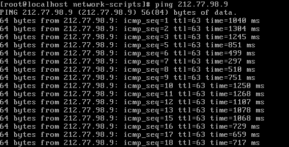

Ustawianie parametrów sieci
---------------------------

![alt text][network]

[network]: ./network.png "Logo Title Text 2"

1. na 1 z komputerów zainstaluj oprogramowanie ``http-chat`` dostępne pod adresem ``https://github.com/jkanclerz/http-chat``

Wejściowe parametry sieci
-------------------------
| Parametr | wartość | komentarz(opcjonalny) |
| ------------- |:-------------:| -----:|
|   PC 1 |  
| IP - address  | 10.0.2.15 | |
| MASKA  | 255.255.255.0 | zapis /24 |
|   |  | |
| PC 2  |  | |
| IP - address  | 10.0.2.15 | CentOS - musiałem połączyć się z siecią za pomocą DHCP - "dhclient -v enp0s3" |
| MASKA  | 255.255.255.0 | zapis /24 |

Weryfikacja połączenia

Polecenie
```
na przykład:
ping 212.77.98.9
```

Efekt


Statyczna konfiguracja parametrów połączenia
Wejściowe parametry sieci
-------------------------
| Parametr | wartość | komentarz(opcjonalny) |
| ------------- |:-------------:| -----:|
|   PC 1 |  
| IP - address  | 192.168.10.10 | |
| MASKA  | 255.255.255.0 | zapis /24 |
|   |  | |
| PC 2  |  | |
| IP - address  | 172.16.100.100 | |
| MASKA  | 255.255.0.0 | zapis /24 |

Weryfikacja połączenia

Polecenie
```
```

Efekt
```
```

Nowa statyczna konfiguracja 

-------------------------
| Parametr | wartość | komentarz(opcjonalny) |
| ------------- |:-------------:| -----:|
|   PC 1 |  
| IP - address  |  | |
| MASKA  |  | |
|   |  | |
| PC 2  |  | |
| IP - address  |  | |
| MASKA  |  | |

Weryfikacja połączenia

Polecenie
```
```

Efekt
```
```

Warto wiedzieć
```
ifup enp0s3 - wlaczenie interface
if down enp0s3 - wylaczenie karty sieciowej
ip a - pokazuje adresy
nmcli - wyswietla stan karty sieciowej itp.
```

-------------------------
| Parametr | wartość | komentarz(opcjonalny) |
| ------------- |:-------------:| -----:|
| Lokalizacja pliku z konfiguracją sieci| cd /etc | |
| UP -> Włączenie interfejsu sieciowego| ip link set {interface_name} up | |
| DOWN -> Wyłączenie interfejsu sieciowego| ip link set {interface_name} down | |
| Sprawdzenie obecnych parametrów | ip addr | |
| lista wszystkich interfejsów | ip link show | |
| Które interfejsy jakie porty słuchają | netstat --listen | |

