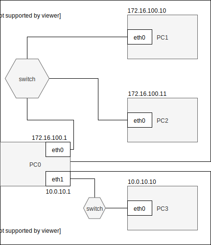

Konfiguracja route
------------------

* routing
    * dodaj trasę default
    * dodaj trasę przez bramę
    * dodaj trasę przez interfejs
    * usuń trasę
    * zmień trasę
    * pobierz trasę dla adresu
     
ip 
-------------------------
| subcommand    |  polecenie   | opis  |
| ------------- |:-------------| :---------------| 
|   ``route``    |                               | |
|               |   ``ip route add``             | Polecenie to służy do dodawania tras do wybranej tablicy routingu |
|                |  ``ip route list``            | wyświetla zawartość tablic routingu |
|                |  ``ip route get``             | pozwala na znalezienie trasy do danego adresu |
|                |  ``ip route show dev eth0``   | pokaż tablicę dla urządzenia eth0 |
| |  ``ip route add 192.168.55.0/24 via 192.168.1.254 dev eth0``| dodaj trasę do sieci 192.168.55.0/24 przez ruter o adresie 192.168.1.254 dla urządzenia eth0 |
|              |    ``ip route add default via 192.168.1.254`` | dodaj domyślną bramę dla urządzenia eth0 |
|              |     ``ip route delete``         | usuń trasę |
 

Zadanie
------------

1.
   * Przygotuj konfigurację sieci zgodnie z powyższym diagramem, 
   * Przetestuj połączenie pomiędzy wszystkimi elementami sieci
   * Dlaczego połączenie może nie działać
2. Przygotuj konfigurację tak aby została załadowana poprawnie po ponownym uruchomieniu systemu
   * Patrz ``utrwalanie statycznej konfiguracji cwiczenia 2``
   * zwróć uwagę na różnice pomiędzy dydtrybucjami systemu
3. Zainstaluj, uruchom i przetestuj działanie aplikacji ``HTTP_CHAT``
   * aplikacja dostępna w serwisie github ``https://github.com/jkanclerz/http-chat``

Zadanie do domu
---------------

1. Przygotuj konfigurację z zadania 1 wykorzystując inny system operacyjny na komputerze pełniącym rolę routera.
  * debian -> centos lub centos -> debian
  * zapewnij poprawną komunikację pomiędzy PC3 -> PC1
  
