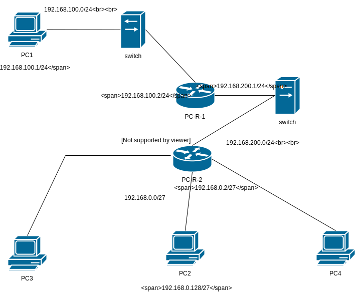

Podsieci i nadsieci IP
----------------------

adresacja
-----------------------------------------------------
| PC     |  interfejs   | adres  |
| --------- |:-------------| :---------------| 
| ``PC1``   | enp0s3 | 192.168.100.1/24     |
| ``PC-R-1``| enp0s3 | 192.168.100.2/24    |
| ``PC-R-1``| enp0s8 | 192.168.200.1/24      |
| ``PC-R-2``| enp0s3 | 192.168.200.2/24      |
| ``PC-R-2``| enp0s8  |  192.168.0.1/27      |
| ``PC-R-2``| enp0s9  |  192.168.0.2/27    |
| ``PC-R-2``| enp0s10 |  192.168.0.3/27    |
| ``PC2``   | enp0s3  |  192.168.0.128/27     |

routing
-------

| destination | trasa | interfejs  |
| --------- |:-------------| :---------------| 
| ``PC1``     |  | enp0s3: 192.168.100.1/24 |
| ``default`` | 192.168.100.1 | enp0s3 ``ip route add default via 192.168.100.2`` |
| ``PC-R-1``  |  |        |
| ``192.168.100.0/24`` | 192.168.100.2 | enp0s3 |
| ``192.168.200.0/24`` | 192.168.200.1 | enp0s8 |
| mozna dzielic   |  |  |
| ``192.168.0.64/27``  |  | enp0s8 |
| ``192.168.0.128/27`` |  | enp0s8 |
| ``192.168.0.192/27`` |  | enp0s8 |
| lub za 1 zamachem   |  |  |
| ``192.168.0.0/24``   |  | enp0s8 |
| ``PC-R-2``  |  |        |
| ``192.168.200.0/24`` |  | enp0s3 |
| ``192.168.100.0/24`` |  | enp0s3 |
| ``192.168.0.64/27``  |   | enp0s8 |
| ``192.168.0.128/27`` |  | enp0s9 |
| ``192.168.0.192/27`` |  | enp0s10 |

Zadanie
------------

1.
   * Przygotuj konfigurację sieci zgodnie z powyższym diagramem
   * W pierwszej kolejności przygotuj ``PC1``, ``PC-R-1``, ``PC-R-2``, ``PC-2``
   * Do konfiguracji wykorzystaj dane z tabeli powyżej
   * Rozszerz istniejącą konfigurację dzieląc istnijącą sieć dla ``PC2`` na 3 podsieci zgodnie z diagramem
   * Przetestuj połączenie pomiędzy wszystkimi elementami sieci ``PC1->PC2`` ``PC1->PC4``
   * Zapewnij permanentną konfigurację, dodając odpowiednie wpisy w plikach konfiguracji

Zadanie do domu
---------------

1. Wykorzystując program dia oraz ikony CISCO
  * Przygotuj diagram powyższej sieci uwzględniając urządzenia tj:
    * ROUTER
    * SWITCH
    * PC
  * Uzupełnij diagram o adresację sieci oraz poszczególnych urządzeń
  
  
