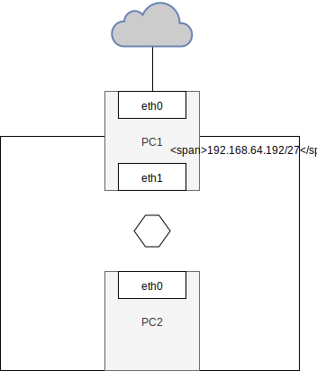

# Zadanie
 

1. Tworzymy globalnie 2 sieci NAT
  * ``192.168.64.192/27``
  * ``172.16.95.216/29``
2. W PC1 tworzymy 2 interfejsy:
  * enp0s8 - ``192.168.64.193/27``
  * enp0s3 - obsługuje połączenie z siecią Internet. Adres IP dynamiczny.
3. W PC2 tworzymy 1 interfejs:
  * enp0s3 - ``192.168.64.194/27``
4. Na PC1 wpisujemy ``ifup enp0s3`` aby włączyć interfejs. Możemy też zrobić stałą konfiguracje -> ``vi /etc/sysconfig/network-scripts/ifcfg-enp0s3`` -> ``ONBOOT=true``
oraz w konsoli wpisac ``reboot`` aby zmiany się wczytały
5. Sprawdzamy czy PC1 ma połączenie z siecią Internet.
 
6. PC1: 
 * ``vi /etc/sysconfig/network`` -> ``FORWARD_IPV4=true``
 * ``iptables -t nat -A POSTROUTING -o enp0s3 -j MASQUERADE``
7. PC2:
 * ``ip route add default via 192.168.64.193 dev enp0s3`` 
Teraz mamy połączenie z internetem również na urządzeniu PC2.
