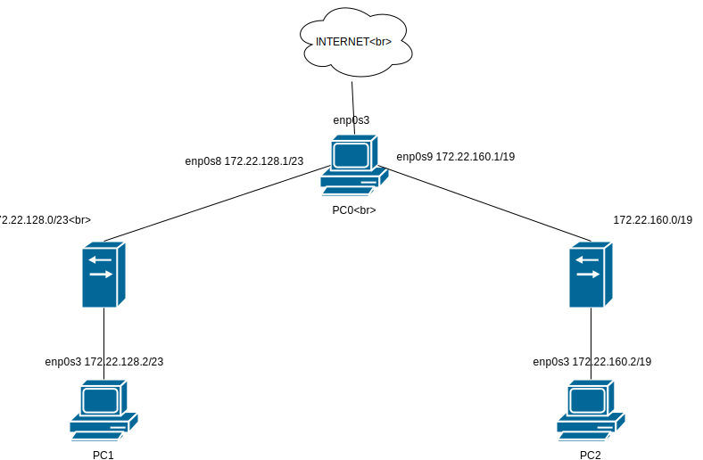

# Zadanie 1 
## Adresy podsieci 
 * ``LAN1`` 172.22.128.0/23
 * ``LAN2`` 172.22.160.0/19
 ## Przygotowanie prototypu rozwiązania
 1. Tworzymy 2 sieci globalne w programie VirtualBox
  * ``172.22.128.0/23``
  * ``172.22.160.0/19``
 2. PC0 posiada 3 interfejsy:
  * enp0s3 ma dostęp do internetu
  * enp0s8 jest w sieci LAN1
  * enp0s9 jest w sieci LAN2
 3. PC1 posiada 1 interfejs
  * enp0s3 jest w sieci LAN1
 4. PC2 posiada 1 interfejs
  * enp0s3 jest w sieci LAN2
 5. Przypisujemy adresy IP 
 *
| PC      | interface   | IP                 |
| ------- | ----------- |--------------------|
| ``PC0`` |enp0s8       |172.22.128.1/23     |
|         |enp0s9       |172.22.160.1/19     |
| ``PC1`` |enp0s3       |172.22.128.2/23     |
| ``PC2`` |enp0s3       |172.22.160.2/19     |

 6. Dodajemy routing w PC1 oraz PC2
  * ``ip route add default via 172.22.128.1 dev enp0s3`` - dla PC1
  * ``ip route add default via 172.22.160.1 dev enp0s3`` - dla PC2
 7. W PC0 włączamy forwarding ``echo 1 > /proc/sys/net/ipv4/ip_forward`` oraz regułę masquerade ``iptables -t nat -A POSTROUTING -s 172.22.128.0/23 -o enp0s3 -j MASQUERADE`` i ``iptables -t nat -A POSTROUTING -s 172.22.160.0/19 -o enp0s3 -j MASQUERADE``
 8. Mamy już połączenie z siecią Internet na wszystkich trzech urządzeniach.
 ### Schemat
 
